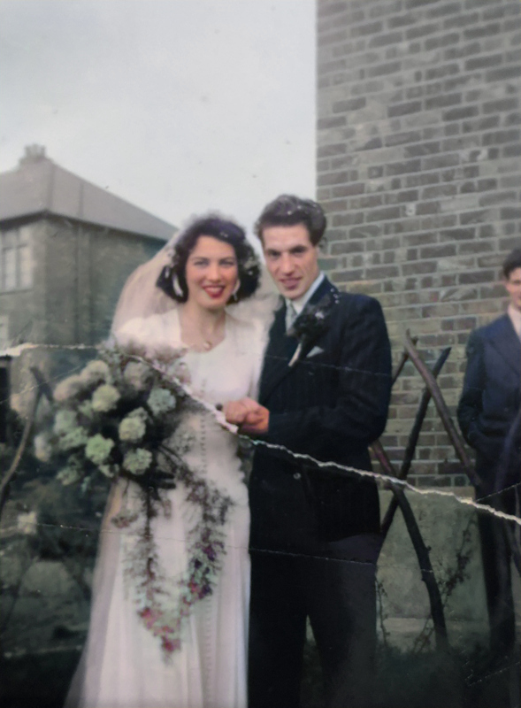
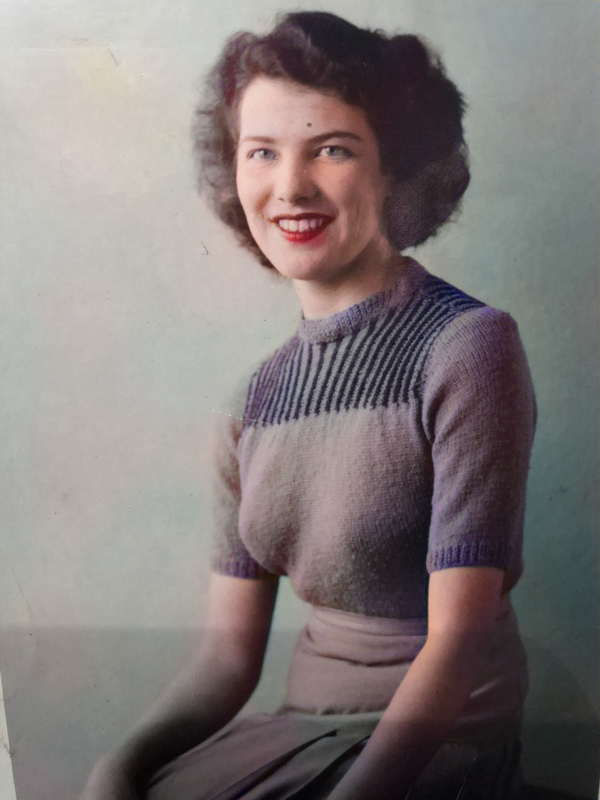
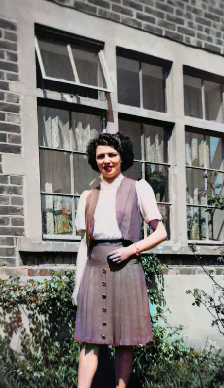
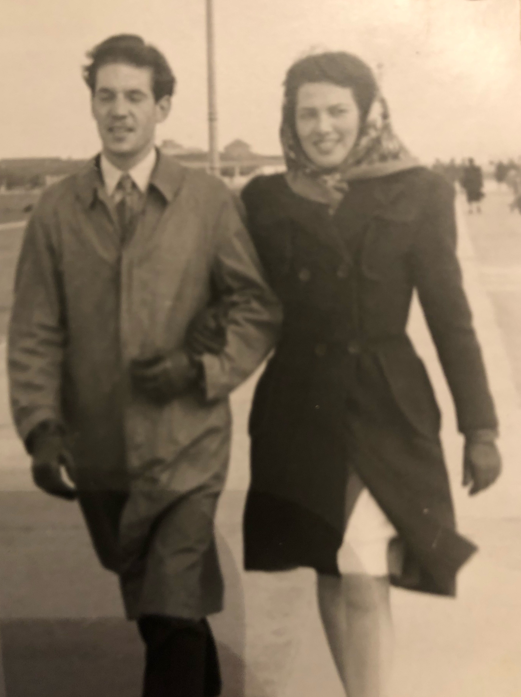
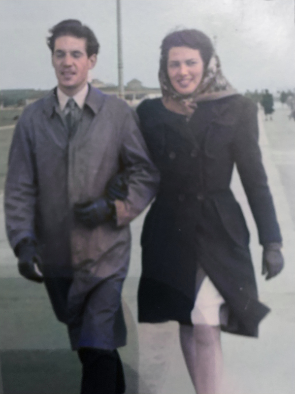

# Colorizing photos using DeepAI's API

[DeepAI's Image Colorization API](https://deepai.org/machine-learning-model/colorizer)

## Examples

| Original | Colorized |
|----------|-----------|
|  |  |
|  |  |
|  |  |
|  |  |

---

